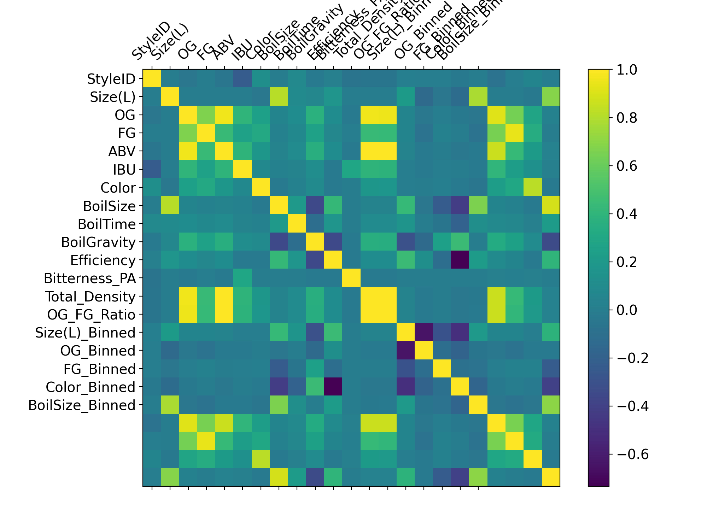
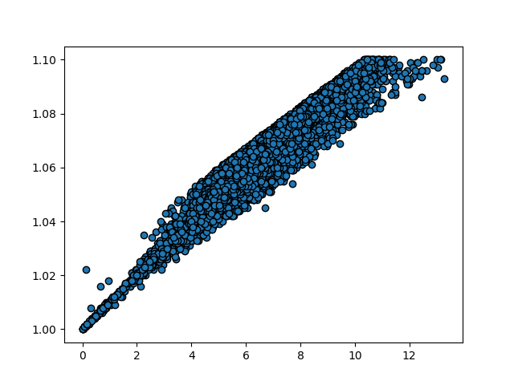
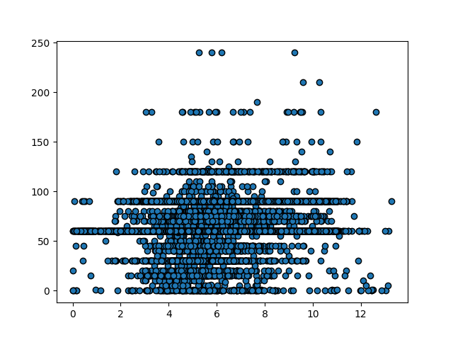

# Rapport de Projet - Brew

## Données

Elles ont été téléchargé depuis le site [Kaggle](https://www.kaggle.com/datasets/jtrofe/beer-recipes) et les données viennent du site [Brewer's Friend](https://www.brewersfriend.com/search/)

Voici un descriptif de toutes les colonnes :

**BeerID** : Identifiant unique de la bière **(Entier)**

**Name** : Nom de la bière **(Texte)**

**URL** : URL associée à la bière **(Texte)**

**Style** : Style de bière **(Texte,** Ensemble défini)

**StyleID** : Identifiant unique du style de bière **(Entier)**

**Size(L)** : Taille de la bière en litres **(Nombre décimal)**

**OG** : Gravité originale (Original Gravity) de la bière (Nombre décimal)

**FG** : Gravité finale (Final Gravity) de la bière **(Nombre décimal)**

**ABV** : Teneur en alcool par volume (Alcohol by Volume) de la bière **(Nombre décimal)**

**IBU** : Unités d'amertume internationales (International Bitterness Units) de la bière **(Nombre décimal)**

**Color** : Couleur de la bière **(Nombre décimal)**

**BoilSize** : Taille de l'ébullition en litres **(Nombre décimal)**

**BoilTime** : Temps d'ébullition en minutes **(Entier)**

**BoilGravity** : Gravité de l'ébullition **(Nombre décimal)**

**Efficiency** : Efficacité du processus brassicole **(Nombre décimal)**

**MashThickness** : Épaisseur de la purée **(Nombre décimal)**

**SugarScale** : Échelle de mesure du sucre **(Texte, Ensemble défini)**

**BrewMethod** : Méthode de brassage **(Texte, Ensemble défini)**

**PitchRate** : Taux d'ensemencement **(Nombre décimal)**

**PrimaryTemp** : Température de fermentation primaire **(Nombre décimal)**

**PrimingMethod** : Méthode de priming **(Texte, Ensemble défini)**

**PrimingAmount** : Quantité de priming **(Texte, Ensemble défini)**

**UserId** : Identifiant unique de l'utilisateur **(Entier)**

## Pré traitement

Les colonnes BeerID, UserID, URL, Name, ont étés supprimé car pas d'interet dans notre utilisation d'entrainement et de prédiction.

Les colonnes PrimingMethod, PrimingAmount, PitchRate, MashThickness, PrimaryTemp, SugarScale ont été supprimées car comportant trop de valeur nulles.

On a aussi supprimé les lignes qui contiennent des valeurs manquantes

On a ensuite supprimé les valeurs qu'on trouvait trop grande.
Soit en supprimant les 5% de données les plus hautes, soit dans le cas de l'IBU, en supprimant les valeurs au dessus de 150, car pas fiable.

Nous avons créé 3 features :

1. Bitterness PA : Amertume par unité d'alcool
2. Total Density : Concentration de sucre dans la bière
3. OG FG Ration : Taux de fermentation d'une bière

On a utilisé la technique de Hot One sur la colonne **BrewMethod** qui comporte des valeurs défini pour pouvoir mieux les exploiter en suivant.

## Analyse Exploratoire

Nous avons fait une matrice de corrélation pour voir les corrélation entre les différentes colonnes

On peut constater au croisement de la colonne ABV et OG une valeur proche de 1, qui indique une forte corrélation entre les deux

Alors qu'au contraire, au croisement des colonnes ABV et BoilTime, on peut constater une valeur proche de 0.

En affichant les valeurs des colonnes ABV et OG sous forme de nuage de points, on voit très bien que les deux valeurs sont étroitement liés

En faisant de même avec les valeurs de ABV et BoilTime, on peut aussi voir que les deux features sont très peu corrélées.

